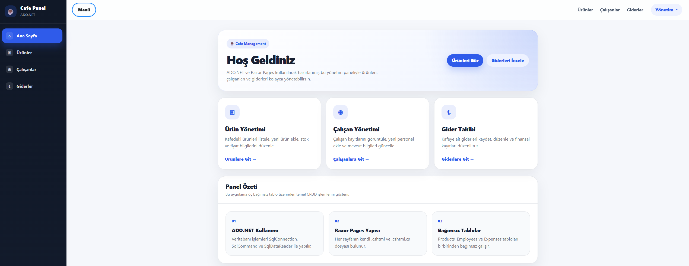
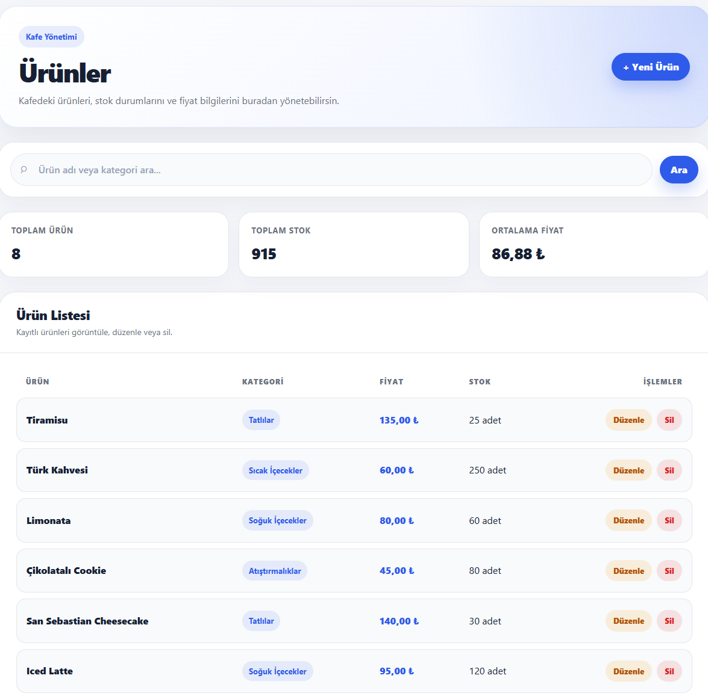
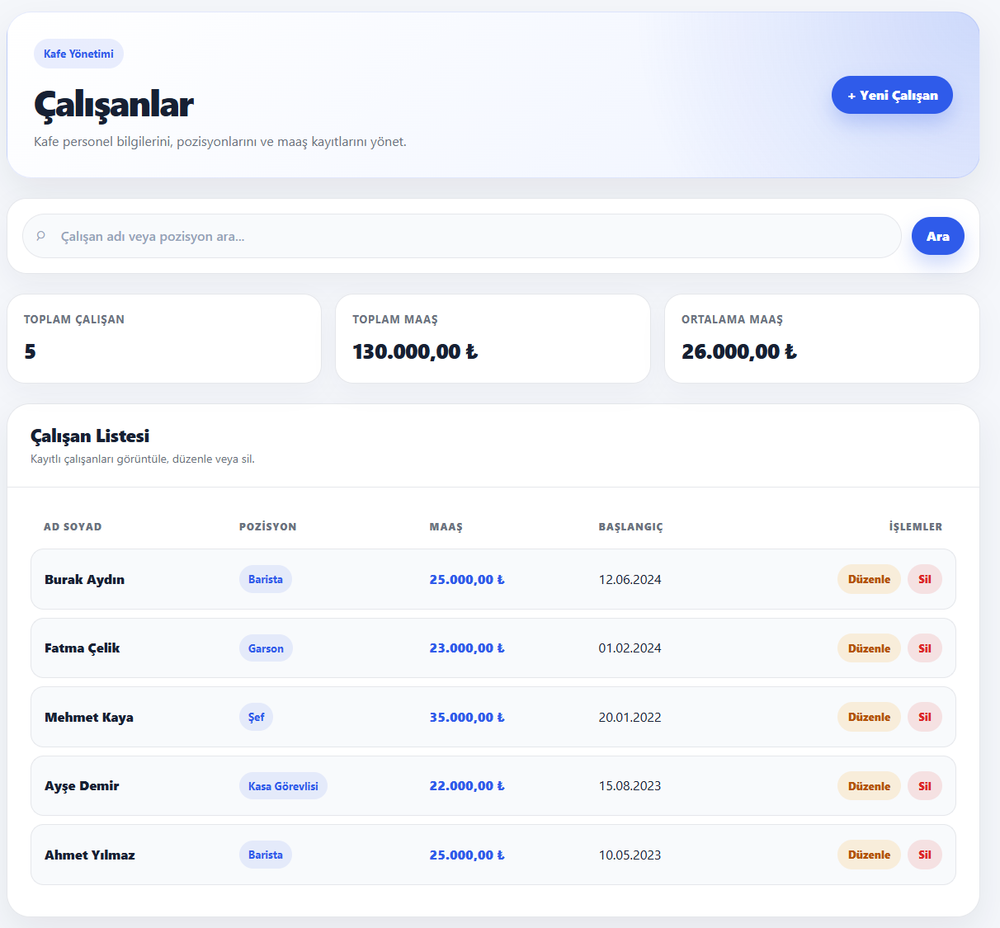
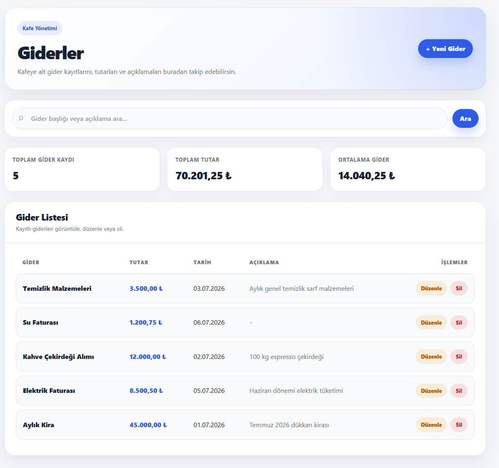
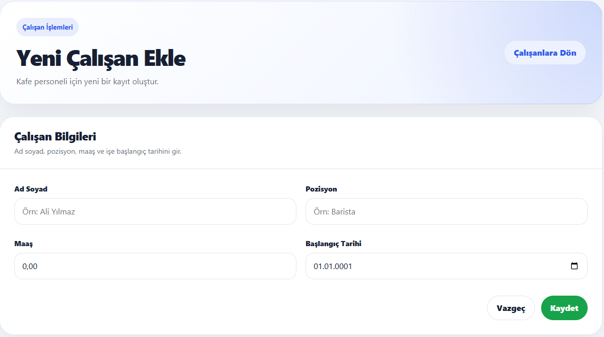
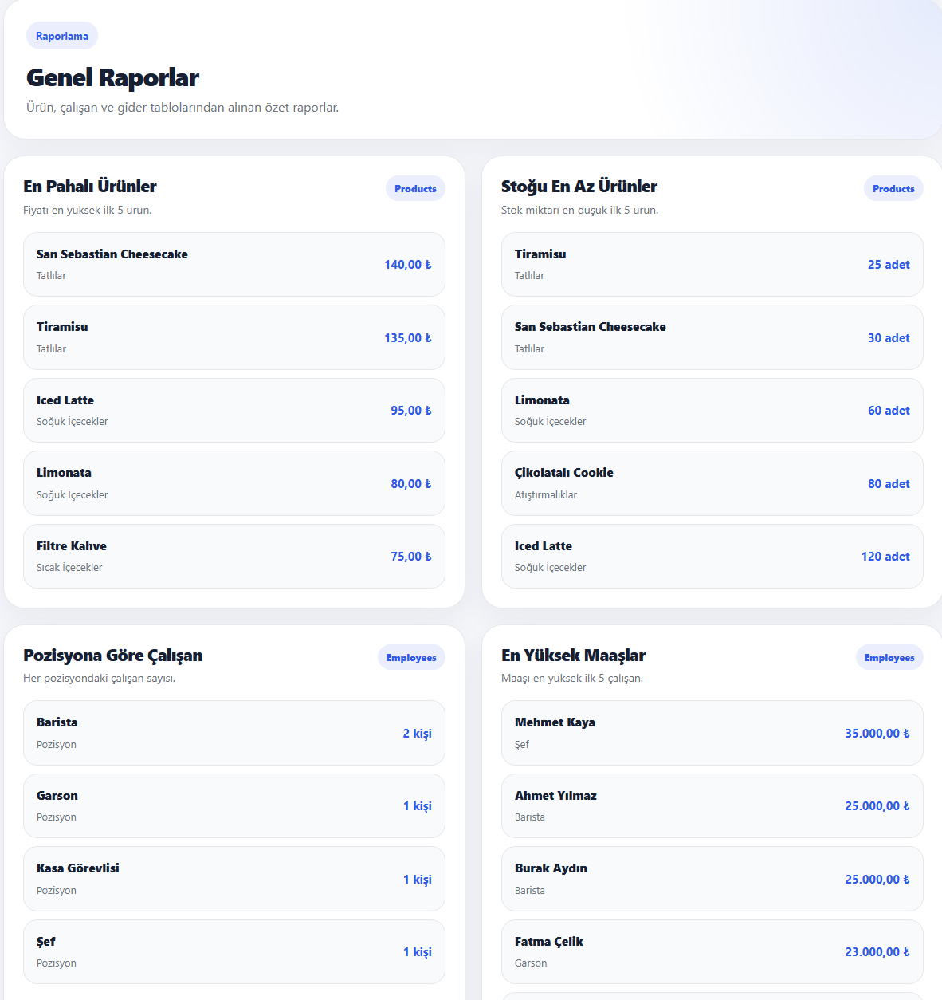

# Cafe Management System (ADO.NET)
Bu proje, bir kafenin temel yönetim işlemlerini dijitalleştirmek amacıyla geliştirilmiş bir **ASP.NET Core Razor Pages** web uygulamasıdır. Veritabanı işlemleri için ORM (Entity Framework vb.) kullanılmamış, doğrudan **ADO.NET** (`Microsoft.Data.SqlClient`) tercih edilerek yüksek performanslı ve doğrudan SQL sorgularıyla veri erişimi sağlanmıştır.
## 🚀 Özellikler
Uygulama temel olarak 3 ana modülden oluşmaktadır:
*   **Ürün Yönetimi (Products):** Kafede satılan ürünlerin (isim, kategori, fiyat, stok bilgisi) eklenmesi, listelenmesi, güncellenmesi ve silinmesi.
*   **Çalışan Yönetimi (Employees):** Kafe personelinin (ad-soyad, pozisyon, maaş, işe başlama tarihi) takibi ve yönetimi.
*   **Gider Yönetimi (Expenses):** İşletmeye ait giderlerin (gider başlığı, tutar, tarih, açıklama) kaydedilmesi ve raporlanması.
## 🛠️ Kullanılan Teknolojiler
*   **Framework:** .NET 10.0 (ASP.NET Core Web - Razor Pages)
*   **Veri Erişim Türü:** ADO.NET (`Microsoft.Data.SqlClient`)
*   **Veritabanı:** Microsoft SQL Server
*   **Front-End:** HTML, CSS, Bootstrap (Razor sayfalarıyla entegre)
## ⚙️ Kurulum ve Çalıştırma
Projeyi yerel geliştirme ortamınızda çalıştırmak için aşağıdaki adımları izleyebilirsiniz:
### 1. Veritabanı Kurulumu
Proje, SQL Server üzerinde `CafeDb` isimli bir veritabanı arayacaktır. SQL Server Management Studio (SSMS) üzerinden `CafeDb` veritabanını oluşturun ve modellerdeki yapıya uygun olarak ilgili tabloları ekleyin:
*   **Products:** `ProductId` (PK, Identity), `ProductName`, `Category`, `Price`, `Stock`
*   **Employees:** `EmployeeId` (PK, Identity), `FullName`, `Position`, `Salary`, `StartDate`
*   **Expenses:** `ExpenseId` (PK, Identity), `ExpenseTitle`, `Amount`, `ExpenseDate`, `Description`
### 2. Bağlantı Dizesini (Connection String) Ayarlama
Proje dizinindeki `appsettings.json` dosyasını açın ve `DefaultConnection` bölümündeki `Server` adını kendi veritabanı sunucunuza göre düzenleyin.

## 📸 Ekran Görüntüleri (Screenshots)

Kafe yönetim sisteminin kullanıcı arayüzüne ve işlem ekranlarına ait görsellere aşağıdan ulaşabilirsiniz:

### 🏠 Ana Sayfa (Genel Bakış)

---

### 📋 Yönetim ve Listeleme Ekranları
Kafedeki ürünlerin, çalışanların ve işletme giderlerinin takip edildiği temel listeleme arayüzleri:

<table width="100%">
  <tr>
    <td width="33%" align="center">
      <strong>Ürünler (Products)</strong> 
      
    </td>
    <td width="33%" align="center">
      <strong>Çalışanlar (Employees)</strong> 
      
    </td>
    <td width="33%" align="center">
      <strong>Giderler (Expenses)</strong> 
      
    </td>
  </tr>
</table>

---

### ⚙️ İşlem ve Raporlama Ekranları
Sisteme yeni personel ekleme arayüzü ve işletmeye ait genel verilerin sunulduğu raporlama ekranı:

<table width="100%">
  <tr>
    <td width="50%" align="center">
      <strong>Yeni Çalışan Ekle (Add Employee)</strong> 
      
    </td>
    <td width="50%" align="center">
      <strong>Raporlar (Reports)</strong> 
      
    </td>
  </tr>
</table>
